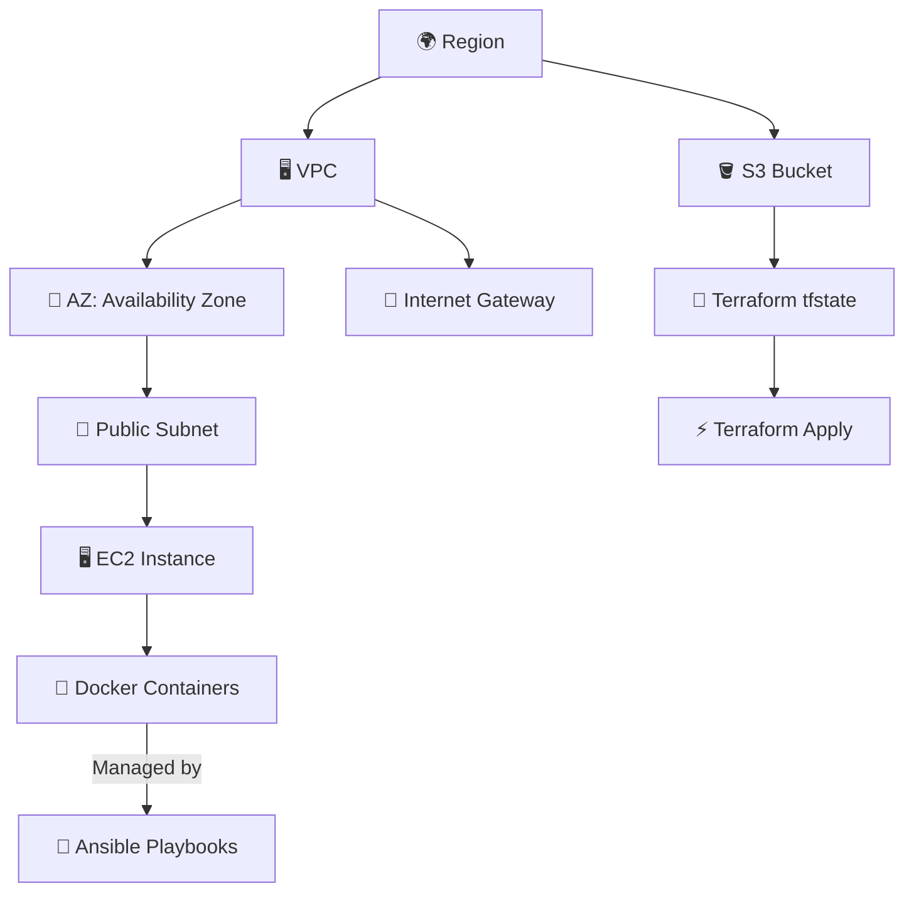

# Cloud Infrastructure Automation with Terraform, Docker, and Ansible

 

A complete IaC solution for deploying containerized applications on AWS using Terraform for provisioning, Docker for containerization, and Ansible for configuration management.
---
## Table of Contents

1. [Architecture Overview](#-Architecture-Overview)
2. [Features](#-Featuress)
3. [Tools & Technologies](#️-tools--technologies)
4. [Terraform Modules](#-terraform-modules)
5. [Folder Structure](#-folder-structure)

---
## Architecture Overview

---

## 🚀 Features

- ✅ Automated infrastructure provisioning with Terraform
- ✅ Configuration management using Ansible
- ✅ Containerized application deployment with Docker
- ✅ Remote state management via S3
- ✅ Modular and scalable design

---
## Prerequisites

Before getting started, ensure you have the following installed and configured:

- ✅ **AWS Account** with programmatic access
- ✅ IAM permissions for:
  - EC2
  - VPC
  - S3
- ✅ **Terraform** v1.0+
- ✅ **Ansible** v2.10+
- ✅ **AWS CLI** configured with credentials (`aws configure`)
- ✅ **Docker** (for local testing and containerization)

## Workflow Overview
**1. Infrastructure Provisioning (Terraform)**
Creates VPC, subnets, EC2 instances, and an S3 bucket

Configures security groups for SSH and HTTP access

**2. Configuration Management (Ansible)**
Connects to EC2 instances using SSH

Installs Docker and required dependencies

Deploys containers with specified port mappings

**3. Application Deployment (Docker)**
Launches containers with health checks

Exposes services on configured ports

Optionally sets up logging and monitoring

