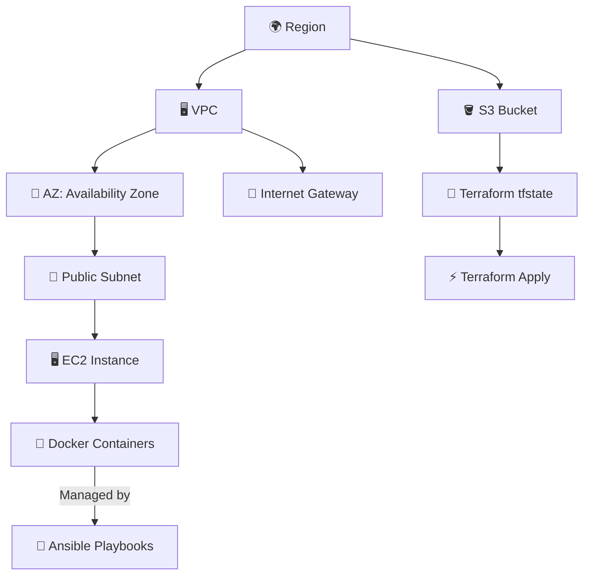

# Cloud Infrastructure Automation with Terraform, Docker, and Ansible

 
[](LICENSE)

A complete IaC solution for deploying containerized applications on AWS using Terraform for provisioning, Docker for containerization, and Ansible for configuration management.
---
## 📚 Table of Contents

1. [📌 Architecture Overview](#architecture-overview)
2. [🚀 Features](#-features)
3. [🛠️ Tools & Technologies](#️-tools--technologies)
4. [📦 Terraform Modules](#-terraform-modules)
5. [📂 Folder Structure](#-folder-structure)
6. [⚙️ Prerequisites](#prerequisites)
7. [🔄 Workflow Overview](#workflow-overview)
---
## Architecture Overview

---

## 🚀 Features

- ✅ Automated infrastructure provisioning with Terraform
- ✅ Configuration management using Ansible
- ✅ Containerized application deployment with Docker
- ✅ Remote state management via S3
- ✅ Modular and scalable design

---

## 🛠️ Tools & Technologies

| Tool        | Purpose                        |
|-------------|--------------------------------|
| Terraform   | Infrastructure provisioning    |
| Ansible     | Configuration management       |
| Docker      | Containerization               |
| AWS EC2     | Hosting Docker containers      |
| AWS S3      | Remote backend for tfstate     |

---

## 📦 Terraform Modules

This project is structured using reusable Terraform modules:

| Module  | Description |
|---------|-------------|
| `vpc`   | Creates the VPC, public subnets, internet gateway, and route tables. |
| `ec2`   | Launches EC2 instances into public subnets. |

Each module is isolated and parameterized to ensure flexibility, scalability, and reuse in other projects.

---
## 📂 Folder Structure

```bash
Docker-App-Deployment-on-AWS-using-Ansible-Terraform/
├── ec2/                         # EC2 module
├── key/                         # SSH key pair
├── my-web/                      # Application files
├── vpc/                         # VPC module
├── backend.tf                   # S3 state configuration
├── inventory.ini                # Ansible inventory
├── main.tf                      # Core resources
├── playbook.yaml                # Ansible playbook
├── providers.tf                 # AWS provider configuration
├── terraform.tfvars             # Environment variables
├── variable.tf                  # Global variables
└── README.md                    # Project documentation
```
---
## Prerequisites

Before getting started, ensure you have the following installed and configured:

- ✅ **AWS Account** with programmatic access
- ✅ IAM permissions for:
  - EC2
  - VPC
  - S3
- ✅ **Terraform** v1.0+
- ✅ **Ansible** v2.10+
- ✅ **AWS CLI** configured with credentials (`aws configure`)
- ✅ **Docker** (for local testing and containerization)
---
## Workflow Overview
**1. Infrastructure Provisioning (Terraform)**
Creates VPC, subnets, EC2 instances, and an S3 bucket

Configures security groups for SSH and HTTP access

**2. Configuration Management (Ansible)**
Connects to EC2 instances using SSH

Installs Docker and required dependencies

Deploys containers with specified port mappings

**3. Application Deployment (Docker)**
Launches containers with health checks

Exposes services on configured ports

Optionally sets up logging and monitoring

---
## 🌐 Accessing the Application

After successful deployment:

- 🌍 **Web Access:**  
  Access the web application using the **DNS name of the Application Load Balancer (ALB)** provided in the Terraform output.


Example:
```bash
curl http://<alb_dns_name>
```

