# Cloud Infrastructure Automation with Terraform, Docker, and Ansible

 

A complete IaC solution for deploying containerized applications on AWS using Terraform for provisioning, Docker for containerization, and Ansible for configuration management.

## Table of Contents

1. [📌 Architecture Overview](#-architecture-overview)
2. [🚀 Features](#-features)
3. [🛠️ Tools & Technologies](#️-tools--technologies)
4. [📦 Terraform Modules](#-terraform-modules)
5. [📂 Folder Structure](#-folder-structure)

## Architecture Overview

``` mermaid
graph TD
  A[🌍 Region] --> B[🖥️ VPC]
    B --> C[📍 AZ: Availability Zone]
    C --> D[📶 Public Subnet]
    D --> E[🖥️ EC2 Instance]
    E --> F[🐳 Docker Containers]
    F -->|Managed by| G[🤖 Ansible Playbooks]
    B --> H[🌉 Internet Gateway]
    A --> I[🪣 S3 Bucket]
    I --> J[📁 Terraform tfstate]
    J --> K[⚡ Terraform Apply]
```

## Prerequisites

Before getting started, ensure you have the following installed and configured:

- ✅ **AWS Account** with programmatic access
- ✅ IAM permissions for:
  - EC2
  - VPC
  - S3
- ✅ **Terraform** v1.0+
- ✅ **Ansible** v2.10+
- ✅ **AWS CLI** configured with credentials (`aws configure`)
- ✅ **Docker** (for local testing and containerization)

## Workflow Overview
**1. Infrastructure Provisioning (Terraform)**
Creates VPC, subnets, EC2 instances, and an S3 bucket

Configures security groups for SSH and HTTP access

**2. Configuration Management (Ansible)**
Connects to EC2 instances using SSH

Installs Docker and required dependencies

Deploys containers with specified port mappings

**3. Application Deployment (Docker)**
Launches containers with health checks

Exposes services on configured ports

Optionally sets up logging and monitoring

